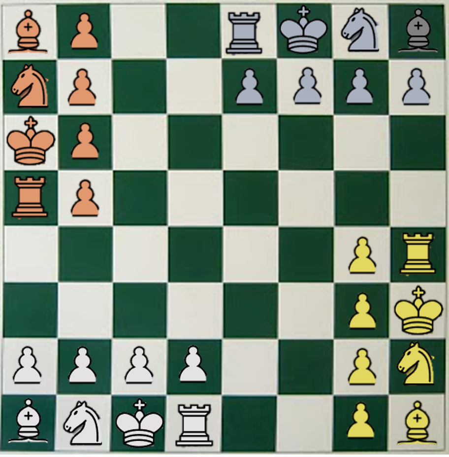
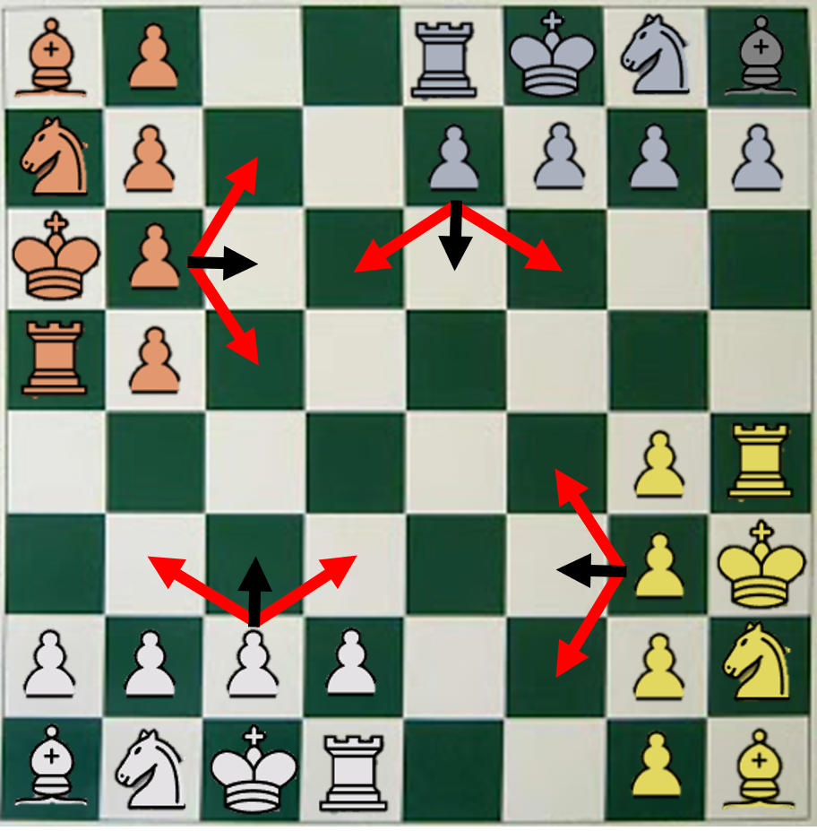

Rules of Chess
==============

Standard Chess
--------------

Implementation will follow the rules set out by wikipedia.

Chess Nine Sixty
----------------

Implementation will follow the rules set out here.

Chess 4.5
---------

Implementation will follow the rules set out here.

Four Player Chess
-----------------

### Layout

For this custom variation there are 4 players start with 8 pieces each.

* 4 Pawns
* 1 Rook
* 1 Knight
* 1 Bishop
* 1 King

The game starts off with the following layout of pieces.

### Moving

Like standard chess, White moves first and then players move in a clockwise direction. Player keep making moves until they are either out of the game or win. Like standard chess you cannot skip a turn, and a move must be made.

The pieces move in the same way as they do in standard chess (see standard chess rules above) with the following exceptions and modifications:

* **Only pawns can be moved on the players first move**
* Pawns cannot move 2 spaces on their first move.
* The En Passant move is not available to pawns.
* Rooks cannot castle (its not really possible from the starting position anyway).

The pawns will move in the direction that they are facing. See the following image for clarification, where the black arrows are the normal forward moves and the red arrows are the possible kill moves.

### Allies

One major addition on top of standard chess rules is the ability to ally with other players. The idea is fairly simple, where players can ally with up to 2 other players to form a team. All members of a team will be explicitly known to each other member but anyone not in the team will not be notified of an alliance being formed or broken. Obviously a single team cannot have four members as the team would not have any opposition.

Alliances can be broken without notice. This allowing players to essentially betray their team. In order to make betrayals functional, players can negoitate other alliances while being in a different alliance but cannot actually join the other alliance until they have exited their existing alliance. This doesn't have many implications for human players as they would do this implicitly anyway. But this does mean that computer players will be considering different alliances and betrayals even during their time in a team.

### Check, Checkmate and Winning

An important difference from standard chess is the protection of the king. Kings can be put into check but the rules do not force the player to protect their king. In the case where your king is placed into check, you will be notified but you can still make any valid move you wish. However if you loose your king you can not longer win. So if you loose your king while you are in single player team, you loose and all your pieces are removed. If you loose your king while being in an alliance, you have the option of removing all your pieces or becoming a protectorate player.

When you first become a protectorate player you loose some pieces from the board. The exact method by which certain pieces are removed from your team after becoming a protectorate is yet undecided. The general idea is too weaken the player to make sure killing a king will have a material affect to the balance of the board. For example, you may loose 40% of your pieces.

After becoming a protectorate, you are still independent in making your moves but are no longer able to break or betray your alliance. You essentially become loyal to the other member of the team. In the case where there are two members in the alliance still have their kings, you are randomly assigned a player, to which you are loyal.

If all members of the of alliance loose their kings, the team looses and all pieces are removed.

In order to win the game you must be the last player alive, not the last team alive. If a team consists of all the remaining players (e.g. in a 3 v 1 the 1 player is killed) the team is automatically broken up and a 'civil war' breaks out.

### Promotion

The normal promotion rules apply if the pawns reach their respective ends. Like standard chess, you can promote the pawn to any piece with the exception of the king. This means that it is possible to get a queen in this game, but only through promotion.
